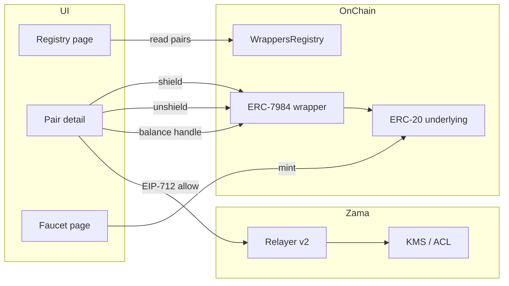

# Architecture — Confidential Wrapper Registry

## Goal

Turn the on-chain [Confidential Token Wrappers Registry](https://docs.zama.org/protocol/protocol-apps/confidential-tokens/wrapper-registry) into a product developers and users can bookmark: discover pairs, move funds in and out of confidentiality, and read decrypted balances with standard EIP-712 authorization.

## Stack

- **Frontend:** React 19, Vite 6, React Router 7
- **Wallet:** wagmi 2 + injected connector (Sepolia + mainnet)
- **FHE / confidential tokens:** `@zama-fhe/react-sdk` 3.x
  - `RelayerWeb` with built-in `SepoliaConfig` / `MainnetConfig` (Zama-hosted relayers)
  - `WagmiSigner` bridges wallet read/write + `signTypedData` for decrypt credentials

## Data flow

## Registry reads

- `useListPairs({ metadata: true })` — paginated pairs with token names/symbols
- `useTokenPairsLength()` — total pair count for coverage display
- `useWrappersRegistryAddress()` — resolves registry for active chain

Revoked pairs remain visible with `isValid: false` (registry does not delete mappings).

## Wrap / unwrap

- **Wrap:** `useShield` — SDK handles ERC-20 approval, wrapper deposit, decimal conversion
- **Unwrap:** `useUnshield` (amount) or `useUnshieldAll` — SDK runs unwrap request + finalize with public decryption proof

`tokenAddress` in SDK hooks refers to the **confidential** (ERC-7984) contract; `wrapperAddress` is set to the same registry-listed wrapper address.

## Balance decryption

1. User signs EIP-712 via `useAllow([confidentialAddress])`
2. `useConfidentialBalance({ tokenAddress })` reads the on-chain ciphertext handle and user-decrypts via relayer
3. Credentials cached in IndexedDB (`indexedDBStorage`) per SDK defaults

## Sepolia faucet

Mock underlying tokens expose `mint(address,uint256)` (max 1M units per call per Zama docs). The faucet page calls mint on the seven documented cTokenMock underlyings; users then wrap via the registry pair routes.

## Extensibility

- Add search/filter by symbol, export JSON pair list, or “developer snippet” panel (copy addresses + SDK `createToken` example)
- Optional WalletConnect via `VITE_WALLETCONNECT_PROJECT_ID`
- Backend RPC proxy only if public RPC limits become an issue; relayers are already public endpoints

## Legacy package

`packages/contracts` contains a Builder Track whistleblower FHEVM contract; it is not required to run the registry app.
